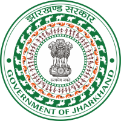

# Jharkhand Vaccination Survey for Pregnant Women





## Introduction

Welcome to the Jharkhand Vaccination Survey for Pregnant Women project, developed by **Yogesh Kumar Jha** at Jharkhand Space Application Center, Ranchi. This web application aims to provide the Government of Jharkhand with valuable insights into the vaccination status of pregnant women across the state. The survey focuses on tracking the administration of TT1 dose, TT2 dose, and booster doses for pregnant women to ensure their optimal health and the health of their unborn children.

## Features

- **User Registration and Authentication:** Pregnant women and healthcare professionals can register and log in to the platform securely.

- **Survey Form:** Registered users can fill out a comprehensive survey form to provide information about their vaccination status. The form includes fields for TT1 dose, TT2 dose, and booster dose.

- **Data Visualization:** The collected survey data is presented through interactive charts and graphs to help government officials understand the vaccination coverage efficiently.

- **Dashboard for Government Officials:** Government officials can access a dedicated dashboard to monitor the overall vaccination status, identify trends, and take data-driven actions.

- **Real-time Notifications:** Registered users receive notifications about upcoming vaccine doses, ensuring timely vaccinations.

- **Data Privacy:** The platform ensures the privacy of personal information while providing aggregated data for analysis.

## Installation and Setup

Follow these steps to set up the Jharkhand Vaccination Survey web application locally:

1. **Clone the Repository:**
   ```
   git clone https://github.com/YogeshKJha/Jharkhand-Vaccination-Survey.git
   cd Jharkhand-Vaccination-Survey
   ```

2. **Install Dependencies:**
   ```
   composer install
   ```

3. **Database Setup:**
   - Create a MySQL database for the project.
   - Copy the `.env.example` file to `.env` and configure the database settings:
     ```
     DB_CONNECTION=mysql
     DB_HOST=127.0.0.1
     DB_PORT=3306
     DB_DATABASE=your_database_name
     DB_USERNAME=your_username
     DB_PASSWORD=your_password
     ```

4. **Generate Application Key:**
   ```
   php artisan key:generate
   ```

5. **Run Migrations and Seeders:**
   ```
   php artisan migrate --seed
   ```

6. **Start the Development Server:**
   ```
   php artisan serve
   ```

Access the application in your web browser at `http://localhost/main/`.

## Contribution

This project is open to contributions. If you would like to contribute to the Jharkhand Vaccination Survey for Pregnant Women, please follow these guidelines:
- Fork the repository and create a new branch.
- Make your enhancements or fixes.
- Create a pull request with a detailed description of your changes.

## Contact

For any inquiries or support, feel free to reach out to Yogesh Kumar Jha at yogeshjha0707@gmail.com.

## License

This project is licensed under the [MIT License](LICENSE).

---

Your feedback and contributions are highly appreciated. Together, we can ensure the health and well-being of pregnant women in Jharkhand through proper vaccination monitoring.
